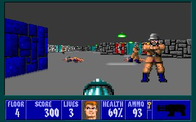
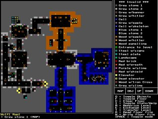
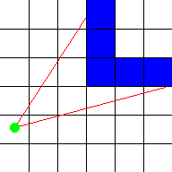
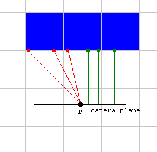

# Raycasting

* [Introdução](#introdução)
* [A Ideia Básica](#a-ideia-básica)
* [Raycaster sem Textura](#raycaster-sem-textura)
* [Raycaster Texturizado]()
* [Texturas 3D de Wolfenstein]()
* [Considerações de Desempenho]()

## Introdução

Raycasting é uma técnica de renderização para criar uma perspectiva 3D em um mapa 2D. Quando os computadores eram mais lentos, não era possível executar mecanismos 3D reais em tempo real, e o raycasting foi a primeira solução. O Raycasting pode ser muito rápido, porque apenas um cálculo deve ser feito para cada linha vertical da tela. O jogo mais conhecido que usou essa técnica, é claro, Wolfenstein 3D.



O mecanismo de raycasting do Wolfenstein 3D era muito limitado, permitindo que ele rodasse até mesmo em um computador 286: todas as paredes têm a mesma altura e são quadrados ortogonais em uma grade 2D, como pode ser visto nesta captura de tela de um editor de mapas para Wolf3D:



Coisas como escadas, saltos ou diferenças de altura são impossíveis de fazer com este motor. Jogos posteriores como Doom e Duke Nukem 3D também usavam raycasting, mas motores muito mais avançados que permitiam paredes inclinadas, alturas diferentes, pisos e tetos texturizados, paredes transparentes, etc... Os sprites (inimigos, objetos e guloseimas) são imagens 2D , mas os sprites não são discutidos neste tutorial por enquanto.

Raycasting não é o mesmo que raytracing! Raycasting é uma técnica semi-3D rápida que funciona em tempo real mesmo em calculadoras gráficas de 4MHz, enquanto raytracing é uma técnica de renderização realista que suporta reflexos e sombras em cenas 3D reais, e só recentemente os computadores se tornaram rápidos o suficiente para fazê-lo em tempo real para resoluções e cenas complexas.

O código dos raycasters não texturizados e texturizados é fornecido neste documento completamente, mas é bastante longo, você também pode baixar o código:

[raycaster_flat.cpp](sources/raycaster_flat.cpp)

[raycaster_textured.cpp](sources/raycaster_textured.cpp)

## A Ideia Básica

A ideia básica do raycasting é a seguinte: o mapa é uma grade quadrada 2D, e cada quadrado pode ser 0 (= sem parede), ou um valor positivo (= uma parede com uma determinada cor ou textura).

Para cada x da tela (ou seja, para cada faixa vertical da tela), envie um raio que começa no local do jogador e com uma direção que depende tanto da direção de olhar do jogador quanto da coordenada x da tela. Então, deixe esse raio avançar no mapa 2D, até atingir um quadrado do mapa que é uma parede. Se ele atingir uma parede, calcule a distância desse ponto de vida até o jogador e use essa distância para calcular a altura que essa parede deve ser desenhada na tela: quanto mais longe a parede, menor ela fica na tela e mais próxima, mais alto parece ser. Estes são todos os cálculos 2D. Esta imagem mostra uma visão geral de cima para baixo de dois desses raios (vermelho) que começam no jogador (ponto verde) e atingem paredes azuis:



Para encontrar a primeira parede que um raio encontra em seu caminho, você deve deixá-la começar na posição do jogador, e então o tempo todo, verificar se o raio está ou não dentro de uma parede. Se estiver dentro de uma parede (hit), então o loop pode parar, calcular a distância e desenhar a parede com a altura correta. Se a posição do raio não estiver em uma parede, você deve rastreá-la ainda mais: adicione um determinado valor à sua posição, na direção da direção desse raio, e para essa nova posição, verifique novamente se está dentro de uma parede ou não. Continue fazendo isso até que finalmente uma parede seja atingida.

Um humano pode ver imediatamente onde o raio atinge a parede, mas é impossível descobrir qual quadrado o raio atinge imediatamente com uma única fórmula, porque um computador só pode verificar um número finito de posições no raio. Muitos raycasters adicionam um valor constante ao raio a cada passo, mas há uma chance de que ele perca uma parede! Por exemplo, com este raio vermelho, sua posição foi verificada em cada ponto vermelho:


Como você pode ver, o raio passa direto pela parede azul, mas o computador não detectou isso, porque só verificou nas posições com os pontos vermelhos. Quanto mais posições você verificar, menor será a chance de o computador não detectar uma parede, mas mais cálculos serão necessários. Aqui a distância do passo foi reduzida pela metade, então agora ele detecta que o raio atravessou uma parede, embora a posição não esteja completamente correta:


Para precisão infinita com este método, seria necessário um tamanho de passo infinitamente pequeno e, portanto, um número infinito de cálculos! Isso é muito ruim, mas, felizmente, existe um método melhor que requer apenas poucos cálculos e ainda detectará todas as paredes: a idéia é verificar todos os lados de uma parede que o raio encontrará. Damos a cada quadrado a largura 1, então cada lado de uma parede é um valor inteiro e os lugares entre eles têm um valor após o ponto. Agora o tamanho do passo não é constante, depende da distância para o próximo lado:


Como você pode ver na imagem acima, o raio atinge a parede exatamente onde queremos. Da forma apresentada neste tutorial, é usado um algoritmo baseado em DDA ou "Análise Diferencial Digital". DDA é um algoritmo rápido normalmente usado em grades quadradas para descobrir quais quadrados uma linha atinge (por exemplo, para desenhar uma linha em uma tela, que é uma grade de pixels quadrados). Portanto, também podemos usá-lo para descobrir em quais quadrados do mapa nosso raio atinge e parar o algoritmo quando um quadrado que é uma parede é atingido.

Alguns raytracers trabalham com ângulos euclidianos para representar a direção do jogador e dos raios, e determinam o Campo de Visão com outro ângulo. Descobri, no entanto, que é muito mais fácil trabalhar com vetores e uma câmera: a posição do jogador é sempre um vetor (coordenada x e y), mas agora também fazemos da direção um vetor: então a direção agora é determinado por dois valores: a coordenada x e y da direção. Um vetor de direção pode ser visto da seguinte forma: se você desenhar uma linha na direção que o jogador olha, através da posição do jogador, então cada ponto da linha é a soma da posição do jogador e um múltiplo da direção do vetor. O comprimento de um vetor de direção realmente não importa, apenas sua direção. Multiplicar x e y pelo mesmo valor altera o comprimento, mas mantém a mesma direção.

This method with vectors also requires an extra vector, which is the camera plane vector. In a true 3D engine, there's also a camera plane, and there this plane is really a 3D plane so two vectors (u and v) are required to represent it. Raycasting happens in a 2D map however, so here the camera plane isn't really a plane, but a line, and is represented with a single vector. The camera plane should always be perpendicular on the direction vector. The camera plane represents the surface of the computer screen, while the direction vector is perpendicular on it and points inside the screen. The position of the player, which is a single point, is a point in front of the camera plane. A certain ray of a certain x-coordinate of the screen, is then the ray that starts at this player position, and goes through that position on the screen or thus the camera plane.


A imagem acima representa essa câmera 2D. O ponto verde é a posição (vetor "pos"). A linha preta, terminando no ponto preto, representa o vetor de direção (vetor "dir"), então a posição do ponto preto é pos+dir. A linha azul representa o plano completo da câmera, o vetor do ponto preto ao ponto azul direito representa o vetor "plano", então a posição do ponto azul direito é pos+dir+plane, e a posição do ponto azul esquerdo é pos+dir-plane (estas são todas adições de vetores).

As linhas vermelhas na imagem são alguns raios. A direção desses raios é facilmente calculada fora da câmera: é a soma do vetor de direção da câmera e uma parte do vetor plano da câmera: por exemplo, o terceiro raio vermelho na imagem passa pela parte direita do plano da câmera no ponto cerca de 1/3 de seu comprimento. Então a direção desse raio é dir + plane*1/3. Essa direção do raio é o vetor rayDir, e os componentes X e Y desse vetor são então usados pelo algoritmo DDA.

As duas linhas externas são as bordas esquerda e direita da tela, e o ângulo entre essas duas linhas é chamado de Campo de Visão ou FOV (Field Of Vision). O FOV é determinado pela razão entre o comprimento do vetor de direção e o comprimento do plano. Aqui estão alguns exemplos de diferentes FOVs:

Se o vetor de direção e o vetor do plano da câmera tiverem o mesmo comprimento, o FOV será de 90°:


Se o vetor de direção for muito maior que o plano da câmera, o FOV será muito menor que 90° e você terá uma visão muito estreita. Você verá tudo mais detalhado e haverá menos profundidade, então isso é o mesmo que aumentar o zoom:


Se o vetor de direção for mais curto que o plano da câmera, o FOV será maior que 90° (180° é o máximo, se o vetor de direção estiver próximo de 0), e você terá uma visão muito mais ampla, como diminuir o zoom:


Quando o jogador gira, a câmera deve girar, então tanto o vetor de direção quanto o vetor de plano devem ser girados. Então, todos os raios irão girar automaticamente também.


Para girar um vetor, multiplique-o pela matriz de rotação

```
[ cos(a) -sin(a) ]
[ sin(a)  cos(a) ]
```

Se você não sabe sobre vetores e matrizes, tente encontrar um tutorial no google, um apêndice sobre isso está planejado para este tutorial mais tarde.

Não há nada que impeça você de usar um plano de câmera que não seja perpendicular à direção, mas o resultado parecerá um mundo "inclinado".

## Raycaster sem Textura

Baixe o código fonte aqui: [raycaster_flat.cpp](sources/raycaster_flat.cpp)

Para começar com o básico, começaremos com um raycaster sem textura. Este exemplo também inclui um contador de fps (quadros por segundo) e teclas de entrada com detecção de colisão para mover e girar.

O mapa do mundo é uma matriz 2D, onde cada valor representa um quadrado. Se o valor for 0, esse quadrado representa um quadrado vazio e percorrível e, se o valor for maior que 0, representa uma parede com uma determinada cor ou textura. O mapa declarado aqui é muito pequeno, apenas 24 por 24 quadrados, e é definido diretamente no código. Para um jogo real, como Wolfenstein 3D, você usa um mapa maior e o carrega de um arquivo. Todos os zeros na grade são espaços vazios, então basicamente você vê uma sala muito grande, com uma parede em volta (os valores 1), uma pequena sala dentro dela (os valores 2), alguns pilares (os valores 3), e um corredor com uma sala (os valores 4). Observe que esse código ainda não está dentro de nenhuma função, coloque-o antes da função principal iniciar.

```cpp
#define mapWidth 24
#define mapHeight 24
#define screenWidth 640
#define screenHeight 480

int worldMap[mapWidth][mapHeight]=
{
  {1,1,1,1,1,1,1,1,1,1,1,1,1,1,1,1,1,1,1,1,1,1,1,1},
  {1,0,0,0,0,0,0,0,0,0,0,0,0,0,0,0,0,0,0,0,0,0,0,1},
  {1,0,0,0,0,0,0,0,0,0,0,0,0,0,0,0,0,0,0,0,0,0,0,1},
  {1,0,0,0,0,0,0,0,0,0,0,0,0,0,0,0,0,0,0,0,0,0,0,1},
  {1,0,0,0,0,0,2,2,2,2,2,0,0,0,0,3,0,3,0,3,0,0,0,1},
  {1,0,0,0,0,0,2,0,0,0,2,0,0,0,0,0,0,0,0,0,0,0,0,1},
  {1,0,0,0,0,0,2,0,0,0,2,0,0,0,0,3,0,0,0,3,0,0,0,1},
  {1,0,0,0,0,0,2,0,0,0,2,0,0,0,0,0,0,0,0,0,0,0,0,1},
  {1,0,0,0,0,0,2,2,0,2,2,0,0,0,0,3,0,3,0,3,0,0,0,1},
  {1,0,0,0,0,0,0,0,0,0,0,0,0,0,0,0,0,0,0,0,0,0,0,1},
  {1,0,0,0,0,0,0,0,0,0,0,0,0,0,0,0,0,0,0,0,0,0,0,1},
  {1,0,0,0,0,0,0,0,0,0,0,0,0,0,0,0,0,0,0,0,0,0,0,1},
  {1,0,0,0,0,0,0,0,0,0,0,0,0,0,0,0,0,0,0,0,0,0,0,1},
  {1,0,0,0,0,0,0,0,0,0,0,0,0,0,0,0,0,0,0,0,0,0,0,1},
  {1,0,0,0,0,0,0,0,0,0,0,0,0,0,0,0,0,0,0,0,0,0,0,1},
  {1,0,0,0,0,0,0,0,0,0,0,0,0,0,0,0,0,0,0,0,0,0,0,1},
  {1,4,4,4,4,4,4,4,4,0,0,0,0,0,0,0,0,0,0,0,0,0,0,1},
  {1,4,0,4,0,0,0,0,4,0,0,0,0,0,0,0,0,0,0,0,0,0,0,1},
  {1,4,0,0,0,0,5,0,4,0,0,0,0,0,0,0,0,0,0,0,0,0,0,1},
  {1,4,0,4,0,0,0,0,4,0,0,0,0,0,0,0,0,0,0,0,0,0,0,1},
  {1,4,0,4,4,4,4,4,4,0,0,0,0,0,0,0,0,0,0,0,0,0,0,1},
  {1,4,0,0,0,0,0,0,0,0,0,0,0,0,0,0,0,0,0,0,0,0,0,1},
  {1,4,4,4,4,4,4,4,4,0,0,0,0,0,0,0,0,0,0,0,0,0,0,1},
  {1,1,1,1,1,1,1,1,1,1,1,1,1,1,1,1,1,1,1,1,1,1,1,1}
};
```

Algumas primeiras variáveis são declaradas: posX e posY representam o vetor de posição do jogador, dirX e dirY representam a direção do jogador e planeX e planeY o plano da câmera do jogador. Certifique-se de que o plano da câmera esteja perpendicular à direção, mas você pode alterar o comprimento dele. A relação entre o comprimento da direção e o plano da câmera determina o FOV, aqui o vetor de direção é um pouco maior que o plano da câmera, então o FOV será menor que 90° (mais precisamente, o FOV é 2 * atan(0.66 /1.0) = 66°, o que é perfeito para um jogo de tiro em primeira pessoa). Mais tarde, ao girar com as teclas de entrada, os valores de dir e plane serão alterados, mas sempre permanecerão perpendiculares e manterão o mesmo comprimento.

The variables time and oldTime will be used to store the time of the current and the previous frame, the time difference between these two can be used to determinate how much you should move when a certain key is pressed (to move a constant speed no matter how long the calculation of the frames takes), and for the FPS counter.

```cpp
int main(int /*argc*/, char */*argv*/[])
{
  double posX = 22, posY = 12;  //x and y start position
  double dirX = -1, dirY = 0; //initial direction vector
  double planeX = 0, planeY = 0.66; //the 2d raycaster version of camera plane

  double time = 0; //time of current frame
  double oldTime = 0; //time of previous frame
```

O resto da função principal começa agora. Primeiro, a tela é criada com uma resolução de sua escolha. Se você escolher uma resolução grande, como 1280*1024, o efeito ficará bastante lento, não porque o algoritmo de raycating seja lento, mas simplesmente porque o upload de uma tela inteira da CPU para a GPU é muito lento.

```cpp
  screen(screenWidth, screenHeight, 0, "Raycaster");
```

Após configurar a tela, inicia-se o gameloop, este é o loop que desenha um quadro inteiro e lê a entrada toda vez.

```cpp
  while(!done())
  {
```

Aqui começa o raycasting real. O loop raycasting é um loop for que passa por cada x, então não há um cálculo para cada pixel da tela, mas apenas para cada faixa vertical, o que não é muito! Para iniciar o loop de raycasting, algumas variáveis são delcaradas e calculadas:

O raio começa na posição do jogador (posX, posY).

cameraX é a coordenada x no plano da câmera que a coordenada x atual da tela representa, feita desta forma para que o lado direito da tela obtenha a coordenada 1, o centro da tela obtenha a coordenada 0 e o lado esquerdo da tela recebe a coordenada -1. A partir disso, a direção do raio pode ser calculada como explicado anteriormente: como a soma do vetor de direção e uma parte do vetor plano. Isso deve ser feito para as coordenadas x e y do vetor (já que adicionar dois vetores é adicionar suas coordenadas x e adicionar suas coordenadas y).

```cpp
    for(int x = 0; x < w; x++)
    {
      //calculate ray position and direction
      double cameraX = 2 * x / double(w) - 1; //x-coordinate in camera space
      double rayDirX = dirX + planeX * cameraX;
      double rayDirY = dirY + planeY * cameraX;
```

Na próxima parte do código, mais variáveis são declaradas e calculadas, estas têm relevância para o algoritmo DDA:

mapX e mapY representam o quadrado atual do mapa em que o raio está. A posição do raio em si é um número de ponto flutuante e contém informações sobre em qual quadrado do mapa estamos e onde estamos nesse quadrado, mas mapX e mapY são apenas as coordenadas desse quadrado.

sideDistX e sideDistY são inicialmente a distância que o raio tem que percorrer desde sua posição inicial até o primeiro lado x e o primeiro lado y. Mais tarde no código, eles serão incrementados enquanto as etapas são executadas.

deltaDistX e deltaDistY são a distância que o raio tem que percorrer para ir de 1 lado x para o próximo lado x, ou de 1 lado y para o próximo lado y. A imagem a seguir mostra o sideDistX inicial, sideDistY e deltaDistX e deltaDistY:


Ao derivar deltaDistX geometricamente você obtém, com Pitágoras, as fórmulas abaixo. Para o triângulo azul (deltaDistX), um lado tem comprimento 1 (pois é exatamente uma célula) e o outro tem comprimento raydirY / raydirX porque é exatamente a quantidade de unidades que o raio percorre na direção y ao dar 1 passo em a direção X. Para o triângulo verde (deltaDistY), a fórmula é semelhante.

```
deltaDistX = sqrt(1 + (rayDirY * rayDirY) / (rayDirX * rayDirX))
deltaDistY = sqrt(1 + (rayDirX * rayDirX) / (rayDirY * rayDirY))
```

Mas isso pode ser simplificado para:

```
deltaDistX = abs(|rayDir| / rayDirX)
deltaDistY = abs(|rayDir| / rayDirY)
```

Onde |rayDir| é o comprimento do vetor rayDirX, rayDirY (que é sqrt(rayDirX * rayDirX + rayDirY * rayDirY)): você pode realmente verificar que, por exemplo, sqrt(1 + (rayDirY * rayDirY) / (rayDirX * rayDirX)) é igual a abs(sqrt(rayDirX * rayDirX + rayDirY * rayDirY) / rayDirX). No entanto, podemos usar 1 em vez de |rayDir|, porque apenas a *proporção* entre deltaDistX e deltaDistY importa para o código DDA que segue abaixo, então temos:

```
deltaDistX = abs(1 / rayDirX)
deltaDistY = abs(1 / rayDirY)
```

Devido a isso, os valores deltaDist e sideDist usados no código não correspondem aos comprimentos mostrados na figura acima, mas seus tamanhos relativos ainda correspondem.

> [obrigado a Artem por detectar essa simplificação]

A variável perpWallDist será usada posteriormente para calcular o comprimento do raio.

O algoritmo DDA sempre saltará exatamente um quadrado em cada loop, seja um quadrado na direção x, ou um quadrado na direção y. Se tiver que ir na direção x negativa ou positiva, e a direção y negativa ou positiva dependerá da direção do raio, e esse fato será armazenado nos passos X e Y. Essas variáveis são sempre -1 ou +1.

Finalmente, hit é usado para determinar se o próximo loop pode ou não ser encerrado, e side conterá se um lado x ou um lado y de uma parede foi atingido. Se um lado x foi atingido, o lado é definido como 0, se um lado y foi atingido, o lado será 1. Por lado x e lado y, quero dizer as linhas da grade que são as bordas entre dois quadrados.

```cpp
      //which box of the map we're in
      int mapX = int(posX);
      int mapY = int(posY);

      //length of ray from current position to next x or y-side
      double sideDistX;
      double sideDistY;

       //length of ray from one x or y-side to next x or y-side
      double deltaDistX = (rayDirX == 0) ? 1e30 : std::abs(1 / rayDirX);
      double deltaDistY = (rayDirY == 0) ? 1e30 : std::abs(1 / rayDirY);
      double perpWallDist;

      //what direction to step in x or y-direction (either +1 or -1)
      int stepX;
      int stepY;

      int hit = 0; //was there a wall hit?
      int side; //was a NS or a EW wall hit?
```

NOTA: Se rayDirX ou rayDirY forem 0, a divisão por zero é evitada configurando-a para um valor muito alto 1e30. Se você estiver usando uma linguagem como C++, Java ou JS, isso não é realmente necessário, pois suporta o padrão de ponto flutuante IEEE 754, que dá o resultado Infinity, que funciona corretamente no código abaixo. No entanto, algumas outras linguagens, como Python, não permitem a divisão por zero, portanto, o código mais genérico que funciona em todos os lugares é fornecido acima. 1e30 é um número alto o suficiente escolhido arbitrariamente e pode ser definido como Infinito se sua linguagem de programação suportar a atribuição desse valor.

Agora, antes que o DDA real possa começar, primeiro stepX, stepY, e os sideDistX e sideDistY iniciais ainda precisam ser calculados.

Se a direção do raio tem um componente x negativo, stepX é -1, se a direção do raio tem um componente x positivo é +1. Se o componente x for 0, não importa qual valor stepX tenha, pois ele não será usado.
O mesmo vale para o componente y.

Se a direção do raio tiver um componente x negativo, sideDistX é a distância da posição inicial do raio até o primeiro lado à esquerda, se a direção do raio tiver um componente x positivo, o primeiro lado à direita será usado.

O mesmo vale para o componente y, mas agora com o primeiro lado acima ou abaixo da posição.

Para estes valores, utiliza-se o valor inteiro mapX e dele subtrai-se a posição real, e em alguns casos acrescenta-se 1,0 consoante se utilize o lado à esquerda ou à direita, de cima ou de baixo. Então você obtém a distância perpendicular a este lado, então multiplique por deltaDistX ou deltaDistY para obter a distância euclidiana real.

```cpp
      //calculate step and initial sideDist
      if (rayDirX < 0)
      {
        stepX = -1;
        sideDistX = (posX - mapX) * deltaDistX;
      }
      else
      {
        stepX = 1;
        sideDistX = (mapX + 1.0 - posX) * deltaDistX;
      }
      if (rayDirY < 0)
      {
        stepY = -1;
        sideDistY = (posY - mapY) * deltaDistY;
      }
      else
      {
        stepY = 1;
        sideDistY = (mapY + 1.0 - posY) * deltaDistY;
      }
```

Agora o DDA real começa. É um loop que incrementa o raio com 1 quadrado a cada vez, até que uma parede seja atingida. Cada vez, ou ele salta um quadrado na direção x (com stepX) ou um quadrado na direção y (com stepY), ele sempre pula 1 quadrado de uma vez. Se a direção do raio for a direção x, o loop só terá que pular um quadrado na direção x toda vez, porque o raio nunca mudará sua direção y. Se o raio estiver um pouco inclinado na direção y, então a cada tantos saltos na direção x, o raio terá que pular um quadrado na direção y. Se o raio for exatamente na direção y, ele nunca terá que pular na direção x, etc...

sideDistX e sideDistY são incrementados com deltaDistX a cada salto em sua direção, e mapX e mapY são incrementados com stepX e stepY respectivamente.

Quando o raio atinge uma parede, o loop termina, e então saberemos se um lado x ou um lado y de uma parede foi atingido na variável "side", e qual parede foi atingida com mapX e mapY. No entanto, não saberemos exatamente onde a parede foi atingida, mas isso não é necessário neste caso porque não usaremos paredes texturizadas por enquanto.

```cpp
      //perform DDA
      while (hit == 0)
      {
        //jump to next map square, either in x-direction, or in y-direction
        if (sideDistX < sideDistY)
        {
          sideDistX += deltaDistX;
          mapX += stepX;
          side = 0;
        }
        else
        {
          sideDistY += deltaDistY;
          mapY += stepY;
          side = 1;
        }
        //Check if ray has hit a wall
        if (worldMap[mapX][mapY] > 0) hit = 1;
      }
```

Depois que o DDA for feito, temos que calcular a distância do raio até a parede, para que possamos calcular a altura que a parede deve ser desenhada depois disso.

Não usamos a distância euclidiana até o ponto que representa o jogador, mas sim a distância até o plano da câmera (ou, a distância do ponto projetado na direção da câmera até o jogador), para evitar o efeito olho de peixe. O efeito olho de peixe é um efeito que você vê se usar a distância real, onde todas as paredes ficam arredondadas e pode deixá-lo doente se você girar.

A imagem a seguir mostra por que tomamos distância do plano da câmera em vez do jogador. Com P o jogador, e a linha preta o plano da câmera: À esquerda do jogador, alguns raios vermelhos são mostrados de pontos de vida na parede para o jogador, representando a distância euclidiana. No lado direito do jogador, alguns raios verdes são mostrados indo de pontos de vida na parede diretamente para o plano da câmera em vez de para o jogador. Portanto, os comprimentos dessas linhas verdes são exemplos da distância perpendicular que usaremos em vez da distância euclidiana direta.

Na imagem, o jogador está olhando diretamente para a parede e, nesse caso, você esperaria que a parte inferior e superior da parede formassem uma linha perfeitamente horizontal na tela. No entanto, todos os raios vermelhos têm um comprimento diferente, então calcularia diferentes alturas de parede para diferentes faixas verticais, daí o efeito arredondado. Os raios verdes à direita têm todos o mesmo comprimento, então darão o resultado correto. O mesmo ainda vale para quando o jogador gira (então o plano da câmera não é mais horizontal e as linhas verdes terão comprimentos diferentes, mas ainda com uma mudança constante entre cada uma) e as paredes se tornam diagonais, mas linhas retas na tela. Esta explicação é um pouco ondulada, mas dá a ideia.



Observe que esta parte do código não é "correção olho-de-peixe", tal correção não é necessária para a forma de raycasting usada aqui, o efeito olho-de-peixe é simplesmente evitado pela forma como a distância é calculada aqui. É ainda mais fácil calcular essa distância perpendicular do que a distância real, nem precisamos saber o local exato onde a parede foi atingida.

Essa distância perpendicular é chamada de "perpWallDist" no código. Uma maneira de calcular é usar a fórmula para a distância mais curta de um ponto a uma linha, onde o ponto é onde a parede foi atingida e a linha é o plano da câmera:


No entanto, pode ser calculado de forma mais simples do que isso: devido à forma como deltaDist e sideDist foram dimensionados por um fator de |rayDir| acima, o comprimento de sideDist já é quase igual a perpWallDist. Nós só precisamos subtrair deltaDist uma vez, dando um passo para trás, porque nos passos de DDA acima nós demos um passo adiante para terminar dentro da parede.

Dependendo se o raio atingiu um lado X ou Y, a fórmula é calculada usando sideDistX ou sideDistY.

```cpp
      //Calculate distance projected on camera direction (Euclidean distance would give fisheye effect!)
      if(side == 0) perpWallDist = (sideDistX - deltaDistX);
      else          perpWallDist = (sideDistY - deltaDistY);
```

Uma derivação mais detalhada da fórmula perpWallDist é mostrada na imagem abaixo, para o lado == 1 caso.

Significado dos pontos:
* P: posição do jogador, (posX, posY) no código.
* H: ponto de acerto do raio na parede. Sua posição y é conhecida como mapY + (1 - step) / 2.
* yDist corresponde a "(mapY + (1 - stepY) / 2 - posY)", esta é a coordenada y do vetor de distância euclidiana, em coordenadas mundiais. Aqui, (1 - stepY) / 2) é um termo de correção que é 0 ou 1 com base na direção y positiva ou negativa, que também é usado na inicialização de sideDistY.
* dir: a direção de busca do jogador principal, dada por dirX, dirY no código. O comprimento desse vetor é sempre exatamente 1. Isso corresponde à direção de observação no centro da tela, em oposição à direção do raio atual. É perpendicular ao plano da câmera e perpWallDist é paralelo a este.
* linha pontilhada laranja (pode ser difícil de ver, use CTRL+scrollwheel ou CTRL+plus para ampliar um navegador de desktop para vê-lo melhor): o valor que foi adicionado a dir para obter rayDir. É importante ressaltar que isso é paralelo ao plano da câmera, perpendicular ao dir.
* A: ponto do plano da câmera mais próximo de H, o ponto onde perpWallDist cruza com o plano da câmera.
* B: ponto do eixo X através do jogador mais próximo de H, ponto onde yDist cruza o eixo X mundial através do jogador.
* C: apontar para a posição do jogador + rayDirX.
* D: apontar para a posição do jogador + rayDir.
* E: Este é o ponto D com o vetor dir subtraído, ou seja, E + dir = D.
* os pontos A, B, C, D, E, H e P são usados na explicação abaixo: eles formam triângulos que são considerados: BHP, CDP, AHP e DEP.

A derivação real:
1. Triângulos PBH e PCD têm a mesma forma, mas tamanhos diferentes, portanto, as mesmas proporções de arestas
2. Dado o passo 1, os triângulos mostram que a razão yDist / rayDirY é igual à razão Euclidiana / |rayDir|, então agora podemos derivar perpWallDist = Euclidean / |rayDir| em vez disso.
3. Triângulos AHP e EDP têm a mesma forma, mas tamanhos diferentes, portanto, as mesmas proporções de arestas. O comprimento da aresta ED, que é |ED|, é igual ao comprimento de dir, |dir|, que é 1. Da mesma forma, |DP| igual a |rayDir|.
4. Dado o passo 3, os triângulos mostram que a razão Euclidiana / |rayDir| = perpWallDist / |dir| = perpWallDist / 1.
5. A combinação das etapas 4 e 2 mostra que perpWallDist = yDist / rayDirY, onde yDist é mapY + (1 - stepY) / 2) - posY
6. No código, sideDistY - deltaDistY, após as etapas DDA, é igual a (posY + (1 - stepY) / 2 - mapY) * deltaDistY (dado que sideDistY é calculado a partir de posY e mapY), então yDist = (sideDistY - deltaDistY ) / deltaDistY
7. Dado que deltaDistY = 1 / |rayDirY|, o passo 6 fornece que yDist = (sideDistY - deltaDistY) * |rayDirY|
8. Combinando os passos 5 e 7 dá perpWallDist = yDist / rayDirY = (sideDistY - deltaDistY) / |rayDirY| /rayDirY.
9. Dado como os casos para sinais de sideDistY e deltaDistY no código são tratados, o valor absoluto não importa e é igual (sideDistY - deltaDistY), que é a fórmula usada


> Obrigado a Thomas van der Berg em 2016 por apontar simplificações do código (perpWallDist pode ser simplificado e o valor reutilizado para wallX).

> Obrigado a Roux Morgan em 2020 por ajudar a esclarecer a explicação de perpWallDist, o tutorial estava faltando algumas informações antes disso

> Obrigado a Noah Wagner e Elias por encontrar mais simplificações para perpWallDist

Agora que temos a distância calculada (perpWallDist), podemos calcular a altura da linha que deve ser desenhada na tela: este é o inverso de perpWallDist, e depois multiplicado por h, a altura em pixels da tela, para trazer para coordenadas de pixel. É claro que você também pode multiplicá-lo por outro valor, por exemplo 2*h, se quiser que as paredes sejam mais altas ou mais baixas. O valor de h fará com que as paredes pareçam cubos com altura, largura e profundidade iguais, enquanto valores grandes criarão caixas mais altas (dependendo do seu monitor).

Então, a partir desta lineHeight (que é, portanto, a altura da linha vertical que deve ser desenhada), são calculadas as posições inicial e final de onde realmente devemos desenhar. O centro da parede deve estar no centro da tela e, se esses pontos estiverem fora da tela, eles serão limitados a 0 ou h-1.

```cpp
      //Calculate height of line to draw on screen
      int lineHeight = (int)(h / perpWallDist);

      //calculate lowest and highest pixel to fill in current stripe
      int drawStart = -lineHeight / 2 + h / 2;
      if(drawStart < 0)drawStart = 0;
      int drawEnd = lineHeight / 2 + h / 2;
      if(drawEnd >= h)drawEnd = h - 1;
```

Finalmente, dependendo do número da parede que foi atingida, uma cor é escolhida. Se um lado y foi atingido, a cor fica mais escura, o que dá um efeito mais agradável. E então a linha vertical é desenhada com o comando verLine. Isso termina o loop de raycasting, depois de ter feito isso para cada x pelo menos.

```cpp
      //choose wall color
      ColorRGB color;
      switch(worldMap[mapX][mapY])
      {
        case 1:  color = RGB_Red;  break; //red
        case 2:  color = RGB_Green;  break; //green
        case 3:  color = RGB_Blue;   break; //blue
        case 4:  color = RGB_White;  break; //white
        default: color = RGB_Yellow; break; //yellow
      }

      //give x and y sides different brightness
      if (side == 1) {color = color / 2;}

      //draw the pixels of the stripe as a vertical line
      verLine(x, drawStart, drawEnd, color);
    }
```

Depois que o loop de raycasting é feito, o tempo do quadro atual e do quadro anterior são calculados, o FPS (quadros por segundo) é calculado e impresso, e a tela é redesenhada para que tudo (todas as paredes e o valor do contador de fps) fica visível. Depois disso, o backbuffer é limpo com `cls()`, para que quando desenharmos as paredes novamente no próximo quadro, o piso e o teto fiquem pretos novamente em vez de ainda conter pixels do quadro anterior.

Os modificadores de velocidade usam frameTime e um valor constante para determinar a velocidade de movimentação e rotação das teclas de entrada. Graças ao uso do frameTime, podemos garantir que a velocidade de movimento e rotação seja independente da velocidade do processador.

```cpp
    //timing for input and FPS counter
    oldTime = time;
    time = getTicks();
    double frameTime = (time - oldTime) / 1000.0; //frameTime is the time this frame has taken, in seconds
    print(1.0 / frameTime); //FPS counter
    redraw();
    cls();

    //speed modifiers
    double moveSpeed = frameTime * 5.0; //the constant value is in squares/second
    double rotSpeed = frameTime * 3.0; //the constant value is in radians/second
```

A última parte é a parte de entrada, as teclas são lidas.

Se a seta para cima for pressionada, o jogador avançará: adicione dirX a posX e dirY a posY. Isso pressupõe que dirX e dirY são vetores normalizados (seu comprimento é 1), mas eles foram inicialmente definidos assim, então está tudo bem. Há também uma detecção de colisão simples embutida, ou seja, se a nova posição estiver dentro de uma parede, você não se moverá. Esta detecção de colisão pode ser melhorada, por exemplo, verificando se um círculo ao redor do jogador não vai para dentro da parede em vez de apenas um único ponto.

O mesmo é feito se você pressionar a seta para baixo, mas a direção será subtraída.

Para girar, se a seta esquerda ou direita for pressionada, tanto o vetor de direção quanto o vetor de plano são girados usando as fórmulas de multiplicação com a matriz de rotação (e sobre o ângulo rotSpeed).

```cpp
    readKeys();
    //move forward if no wall in front of you
    if (keyDown(SDLK_UP))
    {
      if(worldMap[int(posX + dirX * moveSpeed)][int(posY)] == false) posX += dirX * moveSpeed;
      if(worldMap[int(posX)][int(posY + dirY * moveSpeed)] == false) posY += dirY * moveSpeed;
    }
    //move backwards if no wall behind you
    if (keyDown(SDLK_DOWN))
    {
      if(worldMap[int(posX - dirX * moveSpeed)][int(posY)] == false) posX -= dirX * moveSpeed;
      if(worldMap[int(posX)][int(posY - dirY * moveSpeed)] == false) posY -= dirY * moveSpeed;
    }
    //rotate to the right
    if (keyDown(SDLK_RIGHT))
    {
      //both camera direction and camera plane must be rotated
      double oldDirX = dirX;
      dirX = dirX * cos(-rotSpeed) - dirY * sin(-rotSpeed);
      dirY = oldDirX * sin(-rotSpeed) + dirY * cos(-rotSpeed);
      double oldPlaneX = planeX;
      planeX = planeX * cos(-rotSpeed) - planeY * sin(-rotSpeed);
      planeY = oldPlaneX * sin(-rotSpeed) + planeY * cos(-rotSpeed);
    }
    //rotate to the left
    if (keyDown(SDLK_LEFT))
    {
      //both camera direction and camera plane must be rotated
      double oldDirX = dirX;
      dirX = dirX * cos(rotSpeed) - dirY * sin(rotSpeed);
      dirY = oldDirX * sin(rotSpeed) + dirY * cos(rotSpeed);
      double oldPlaneX = planeX;
      planeX = planeX * cos(rotSpeed) - planeY * sin(rotSpeed);
      planeY = oldPlaneX * sin(rotSpeed) + planeY * cos(rotSpeed);
    }
  }
}
```

Isso conclui o código do raycaster não texturizado, o resultado fica assim, e você pode andar pelo mapa:


Aqui está um exemplo do que acontece se o plano da câmera não for perpendicular ao vetor de direção, o mundo parecer distorcido:

